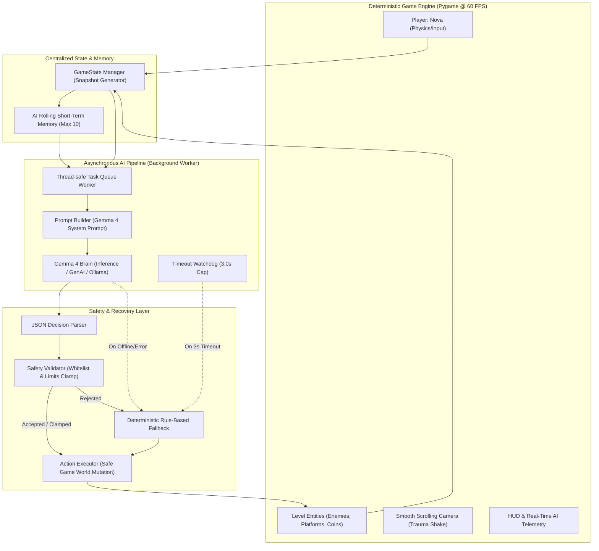

# GEMMA WORLD: AI ADAPTIVE PLATFORMER
*Gemma 4 as the Brain of an Adaptive 2D Game World*

[](https://www.python.org/)
[](https://www.pygame.org/)
[](https://ai.google.dev/gemma)
[]()

---

## 1. Project Overview

**GEMMA WORLD** is a complete, original 2D side-scrolling platformer where Google's **Gemma 4** acts as an autonomous **AI Game Director and World Brain**. 

Unlike conventional platformers with static scripting or chatbots, Gemma 4 actively observes the game state in real time (player health, death rate, combat triumphs, platforming pacing), reasons about player experience and challenge, and issues validated, structured mutations to dynamically reshape the game world.

You play as **Nova**, a cyber explorer equipped with a cyan energy suit and golden visor, traversing vibrant levels while an intelligent AI orchestrator balances challenge and pacing on the fly.

---

## 2. The Problem

Traditional video games rely on fixed difficulty modes (Easy/Normal/Hard) or rudimentary rule thresholds. This produces:
1. **Frustration Spikes**: Novice players get stuck in unforgiving difficulty walls.
2. **Boredom & Monotony**: Skilled players breeze through predictable enemy patterns without excitement.
3. **Static World Design**: The environment never reacts contextually to a player's distinct playstyle.

---

## 3. The Solution

**Gemma as the Game Director:**
* Gemma observes a structured telemetry snapshot of the player and environment every 5 seconds.
* Reasoning over player health, deaths, and momentum, Gemma selects one of **12 whitelisted game world actions**.
* A deterministic **Safety Validator** filters, clamps, and sanitizes decisions to prevent unfair or rogue scenarios.
* The game engine executes safe mutations (spawning items, dialing difficulty, creating platforms, or spawning enemies ahead).
* An intelligent **Fallback Director** guarantees 100% smooth playability even when offline or during network latency.

---

## 4. Why Gemma 4 is Necessary

Gemma 4 provides nuanced contextual reasoning that static if-else logic cannot match:
- **Holistic Contextual Awareness**: Evaluates composite situations (e.g., *"Player is low on health but has defeated 6 enemies in a row without death — they crave thrill, not pity"*).
- **Narrative & Pacing Rationale**: Outputs human-readable rationales behind every world shift, explaining the dramatic balance of the game.
- **Edge-Deployable Intelligence**: Lightweight and fast enough to run locally or via API with minimal compute overhead.

---

## 5. System Architecture



### Core Design Principle:
> **Observe → Reason → Decide → Validate → Act → Recover**
* **Game Engine**: Fast, deterministic, locked at 60 FPS.
* **Gemma**: High-level strategic reasoning in the background.
* **Validator**: Rejects or clamps unauthorized or extreme numbers.
* **Fallback**: Guarantees zero downtime or game freezes.

---

## 6. Key Features

- **Original Characters & Assets**:
  - **Protagonist**: Nova (cyber explorer with dynamic energy aura, bob animations, and ghost speed trails).
  - **3 Enemy Archetypes**: *Walker* (patrols ledges), *Chaser* (stalks player within aggro radius), *Fast* (aerodynamic crimson rusher).
  - **4 Power-Ups**: *Health Crystal* (+35 HP), *Speed Boost* (1.5x speed), *Shield* (absorbs 1 hit), *Coin Magnet* (attracts nearby coins).
  - **Procedural Sound**: Real-time synthesized 8-bit retro audio (no external sound files required).
- **Multi-Level Progression**:
  - `Level 1: Emerald Outpost` (Introductory jumps & Walkers).
  - `Level 2: Neon Canopy` (Verticality, Chasers, moving platforms).
  - `Level 3: Cyber Spires` (Precision acrobatics, Fast enemies, gauntlets).
- **Live F3 Telemetry Panel**:
  - Displays real-time Gemma status, latency in seconds, last decision, stated reason, difficulty meter, and rolling history.
- **Bad AI Decision Demo (F4 Key)**:
  - Injects a simulated rogue AI payload (`count: 1000 enemies`). Live-demonstrates the Safety Validator blocking it:
  `AI DECISION REJECTED: Enemy count exceeds maximum safety threshold (10). Clamped to 1 as safe fallback.`
- **Optional Computer Vision (Press 'C')**:
  - Uses OpenCV webcam feed to detect physical gestures:
    - *Open Hand* ➔ Pauses the game.
    - *Thumbs Up* ➔ Requests a power-up.
    - *Fist* ➔ Requests a challenge enemy.

---

## 7. Technology Stack

* **Language**: Python 3.12+
* **Game Engine**: Pygame 2.6+
* **AI Brain**: Gemma 4 (Google GenAI API / Ollama / Autonomous Local Heuristic)
* **Computer Vision**: OpenCV (`opencv-python`, optional)
* **Testing**: Python `unittest` framework

---

## 8. Installation

1. **Clone the repository**:
   ```bash
   git clone https://github.com/MohitKarankal15/HacktoberFest_Project.git
   cd HacktoberFest_Project
   ```

2. **Install dependencies**:
   ```bash
   pip install -r requirements.txt
   ```

3. *(Optional)* **Configure Gemma API Key**:
   To connect Gemma 4 via Google GenAI:
   ```bash
   # Windows PowerShell
   $env:GEMINI_API_KEY="your-api-key-here"

   # Linux/macOS
   export GEMINI_API_KEY="your-api-key-here"
   ```
   > *Note: If no API key is set, the game automatically runs in Autonomous Fallback Director mode, remaining 100% playable.*

---

## 9. How to Run

Launch the game with a single command:
```bash
python main.py
```

Run unit tests:
```bash
python -m unittest tests/test_ai_pipeline.py
```

---

## 10. Game Controls

| Key | Action |
|---|---|
| **A** / **Left Arrow** | Run Left |
| **D** / **Right Arrow** | Run Right |
| **SPACE** | Jump (Hold for high jump, tap for short hop) |
| **ESC** | Pause Game / Return to Menu |
| **R** | Restart Level (on Game Over or Victory) |
| **F3** | Toggle AI Telemetry & Debug Panel |
| **F4** | **Demo Rogue AI Decision** (1000 Enemies Spawn Attack) |
| **F5** | Force Immediate Gemma Observation |
| **C** | Toggle Webcam Gesture Detector (Optional) |

---

## 11. AI Decision Whitelist

Gemma is strictly constrained to **12 permitted actions**:
1. `do_nothing`
2. `spawn_enemy` (params: `enemy_type`, `count`: 1..3)
3. `spawn_coin` (params: `count`: 1..5)
4. `spawn_powerup` (params: `powerup_type`: health_crystal / speed_boost / shield / magnet)
5. `change_enemy_speed` (params: `multiplier`: 0.5..2.0)
6. `create_platform` (params: `platform_type`: floating / oneway)
7. `remove_platform`
8. `change_weather` (params: `weather`: clear / rain / windy / sunset / night)
9. `increase_difficulty` (params: `step`: 1..2)
10. `decrease_difficulty` (params: `step`: 1..2)
11. `give_health` (params: `amount`: 10..40)
12. `activate_event` (params: `event_name`: coin_rush / enemy_swarm)

---

## 12. Safety, Limits & Fallback System

| Parameter | Safe Limit | Reaction on Violation |
|---|---|---|
| Max Enemies Spawn | 3 (Absolute cap: 10) | Clamped to 3 if 4–10; **Outright REJECTED** and clamped to 1 if >10 |
| Speed Multiplier | 0.5x to 2.0x | Clamped to bounds |
| Max Health Bonus | 40 HP | Clamped to 40 HP |
| Action Name | Must be in Whitelist | **REJECTED**, replaced with `do_nothing` |
| AI Latency Timeout | 3.0 Seconds | Engine triggers Rule-Based Fallback Director |

---

## 13. Demonstration Walkthrough for Presentations

1. Launch game with `python main.py`.
2. Select **[1] PLAY GAME**.
3. Press **F3** to open the **AI Telemetry Panel** on the right side.
4. Play normally: notice Gemma periodically evaluating state and adapting difficulty/spawns.
5. Take intentional damage: observe Gemma or Fallback Director dispensing shields or health crystals.
6. Press **F4**: Observe the live **Rogue Decision Demo**. The notification banner flashes in red:
   `🛡️ AI REJECTED: Enemy count (1000) exceeds maximum safety threshold (10). Clamped to 1 as safe fallback.`
   And only 1 enemy spawns safely!

---

## 14. License

This project is licensed under the MIT License - see the [LICENSE](LICENSE) file for details.